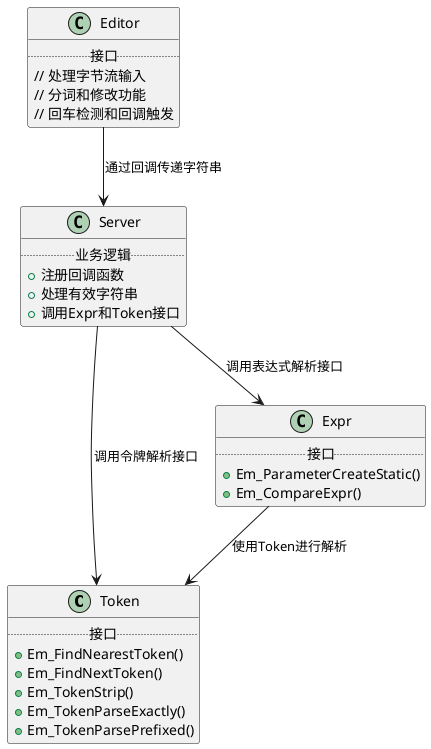

# EmShell 设计文档

## 类关系图



### 关系说明
- Server组件同时依赖于Expr和Token的接口来处理从Editor接收到的有效字符串
- Editor处理字节流输入，当用户敲入回车时，通过回调函数向Server传递有效字符串
- Expr组件使用Token接口进行表达式解析
- Server直接调用Expr和Token的接口来完成业务逻辑

### 组件功能说明
- Editor：输入字节流，对其进行分词、修改等操作，确保当用户敲入回车时，能调用回调函数，传出一个有效的字符串
- Expr：处理表达式解析和比较
- Token：处理令牌识别和解析
- Server：协调各组件工作，处理业务逻辑
```